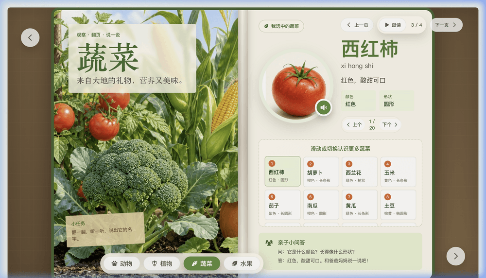
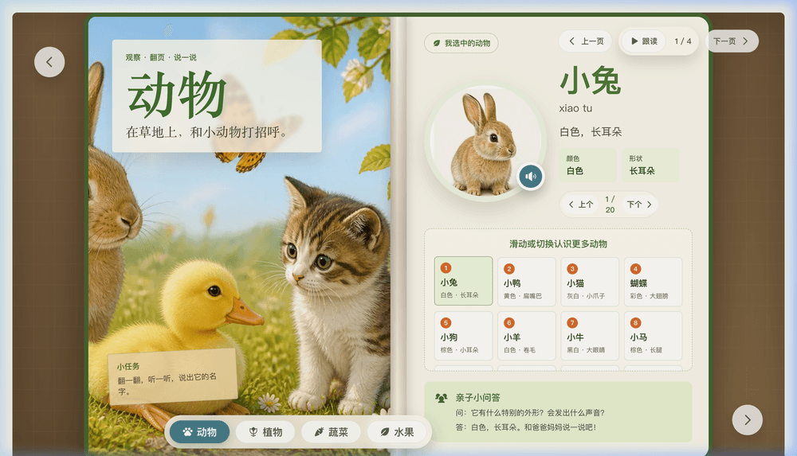
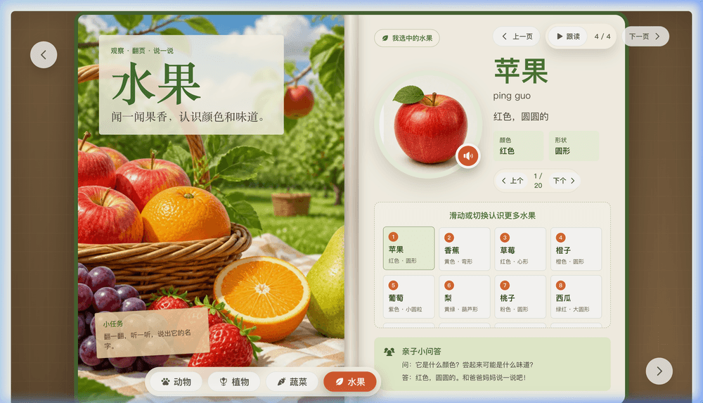

# Little World Picture Book (儿童启蒙认知绘本)

一个面向低龄儿童的互动式启蒙认知绘本。项目围绕**动物**、**植物**、**蔬菜**、**水果**、**交通工具**、**日常用品**、**天气与自然**、**身体与五官**、**职业与工具**九个大类展开，每个大类包含 20 个细分认知示例，并配套真实感插画、翻页切换、中文拼音标注、跟读发音和响应式页面布局。

## 运行效果图

| 蔬菜分类 (Vegetables) | 动物分类 (Animals) | 水果分类 (Fruits) |
| :---: | :---: | :---: |
|  |  |  |

## 项目亮点

- **九大启蒙分类**：涵盖动物、植物、蔬菜、水果、交通工具、日常用品、天气与自然、身体与五官、职业与工具，精选 180 个日常认知对象。
- **真实感场景插画**：左页为大场景，右页为特定认知卡片，还原纸质绘本阅读体验。
- **互动学习交互**：支持左右翻页、卡片点选与拖拽/滑动切换，并带有亲子互动问答。
- **智能语音跟读**：调用浏览器 Speech Synthesis API，支持清晰的标准中文发音与跟读。
- **全端响应式适配**：完美适配桌面、平板和手机屏幕，提供流畅的手势和交互反馈。
- **自动化图片处理**：内置图片裁剪与 WebP 压缩脚本，构建前自动处理图片，减小产物体积。

## 技术栈

- **前端框架**：React 19, Vite
- **图标库**：Phosphor Icons
- **图片处理**：Sharp (用于原始插画的自动裁剪与 WebP 格式压缩)
- **测试验证**：Playwright (端到端交互与多设备响应式验证)

## 快速开始

### 1. 安装依赖

```bash
npm install
```

### 2. 启动开发服务器

```bash
npm run dev
```

启动后可在浏览器中打开本地地址。

### 3. 生产环境构建

```bash
npm run build
```

### 4. 内容校验

```bash
npm test
```

### 5. 预览构建产物

```bash
npm run preview
```

## 部署 (Deployment)

本项目支持一键部署到 **Cloudflare Pages**。

### 方式 A：GitHub 自动集成部署（推荐）

1. 登录 [Cloudflare Dashboard](https://dash.cloudflare.com/)。
2. 导航至 **Workers & Pages** -> **Create application** -> **Pages** -> **Connect to Git**。
3. 选择你的 GitHub 仓库并点击。
4. 在 **Build settings** 中选择或填写：
   - **Framework preset**：`Vite`（或者选择 `None`/`Custom`）
   - **Build command**：`npm run build`
   - **Build output directory**：`dist`
5. 在 **Environment variables (环境变量)** 中配置（非必选，推荐）：
   - `NODE_VERSION` = `20`
6. 点击 **Save and Deploy** 开启自动构建部署。此后，每次将代码推送到 GitHub 的 `main` 分支时，Cloudflare 都会自动拉取依赖、运行切图脚本并完成发布。

### 方式 B：本地 Wrangler CLI 命令行部署

如果你更倾向于在本地构建并一键发布，可以使用 Cloudflare Wrangler 命令行工具：

1. 在本地执行生产构建（包含图片预处理）：
   ```bash
   npm run build
   ```
2. 使用 Wrangler 将构建好的 `dist/` 目录上传部署：
   ```bash
   npx wrangler pages deploy dist
   ```
   *首次运行会提示登录 Cloudflare 账户，根据终端提示选择项目名称完成绑定即可。*

## 图片处理流程

项目使用本地设计的分类插画素材板作为源文件。在启动开发或执行构建时，脚本会自动将素材板切分为单张认知对象图片，并将其转换为高压缩率的 WebP 格式。

如需手动触发图片处理，可以运行：

```bash
npm run prepare-images
```

该脚本会：
1. 读取 `assets/sheets/` 下的分类插画素材板。
2. 自动裁剪出 180 个单体认知示例图。
3. 压缩并生成 `public/media/optimized/` 下的运行时 WebP 图片。

## 目录结构

```text
.
├── .cache/                    # 裁剪缓存目录 (自动生成，已加入 .gitignore)
├── assets/                    # 开发设计源图目录
│   └── sheets/                # 分类插画素材板
├── public/                    # 静态资源目录 (仅包含运行时发布资源)
│   ├── media/optimized/       # 运行时 WebP 图片 (自动生成)
│   └── favicon.png            # 网站图标
├── src/                       # 前端源码与开发资源目录
│   ├── content/bookData.js    # 绘本分类与认知对象数据
│   ├── App.jsx                # 绘本交互主体组件
│   └── styles.css             # 全局响应式布局与样式
├── scripts/prepare-images.mjs # 插画裁剪与压缩脚本
├── vite.config.mjs            # Vite 配置文件
└── package.json               # 依赖及脚本配置文件
```

## 内容维护

若要更新或修改绘本内容：
1. **数据修改**：编辑 `src/content/bookData.js` 文件，可以调整名称、拼音、认知提示（cue）、颜色、形状以及亲子问答内容。
2. **插画更新**：
   - 替换 `assets/sheets/` 下对应大类的素材板图片。
   - 运行 `npm run prepare-images` 重新生成裁剪后的单体图片。
   - 运行 `npm run build` 进行验证与重新打包。
